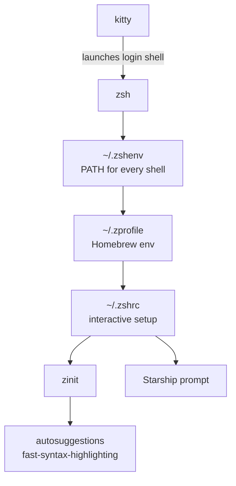

# macOS terminal & shell setup

My terminal environment: **kitty + zsh + zinit + Starship**, with the Tokyo Night theme and
JetBrains Mono Nerd Font.

This README is a step-by-step tutorial to replicate the whole setup on a clean macOS machine,
plus a reference for what every file does.

---

## 1. Tools used

| Tool | Role | Why |
| --- | --- | --- |
| [kitty](https://sw.kovidgoyal.net/kitty/) 0.47 | Terminal emulator | GPU-accelerated, fast, config is a plain text file |
| zsh 5.9 | Shell | Ships with macOS as `/bin/zsh`, no install needed |
| [zinit](https://github.com/zdharma-continuum/zinit) | zsh plugin manager | Fast, self-bootstrapping, no framework overhead |
| [zsh-autosuggestions](https://github.com/zsh-users/zsh-autosuggestions) | Plugin | Greys out a suggestion from history as you type |
| [fast-syntax-highlighting](https://github.com/zdharma-continuum/fast-syntax-highlighting) | Plugin | Colours the command line as you type (valid command = green) |
| [Starship](https://starship.rs/) 1.25 | Prompt | Cross-shell, single TOML file, shows git/language/cloud context |
| [Homebrew](https://brew.sh/) | Package manager | Installs everything above |
| JetBrains Mono Nerd Font | Font | Monospace with the extra glyphs Starship needs |
| Tokyo Night | Colour scheme | kitty theme |

Everything is configured through the files in this repo — no framework (no Oh My Zsh, no
Prezto), so startup stays at roughly **70–90 ms**.

### How the pieces fit together



---

## 2. Repository layout

| File in repo | Installs to | Purpose |
| --- | --- | --- |
| [zsh/zshenv](zsh/zshenv) | `~/.zshenv` | `PATH` for **every** zsh invocation |
| [zsh/zprofile](zsh/zprofile) | `~/.zprofile` | Homebrew environment, login shells only |
| [zsh/zshrc](zsh/zshrc) | `~/.zshrc` | Plugins, history, completions, prompt |
| [starship/starship.toml](starship/starship.toml) | `~/.config/starship.toml` | Prompt symbols |
| [kitty/kitty.conf](kitty/kitty.conf) | `~/.config/kitty/kitty.conf` | Terminal settings |
| [kitty/current-theme.conf](kitty/current-theme.conf) | `~/.config/kitty/current-theme.conf` | Tokyo Night colours |
| [git/gitconfig](git/gitconfig) | `~/.gitconfig` | Git identity |

---

## 3. Installation tutorial

### Step 1 — Install Homebrew

Skip if `brew --version` already works.

```zsh
/bin/bash -c "$(curl -fsSL https://raw.githubusercontent.com/Homebrew/install/HEAD/install.sh)"
```

On Apple Silicon this installs to `/opt/homebrew`. The installer prints a "Next steps" block —
you can ignore it, since [zsh/zprofile](zsh/zprofile) already contains the required
`brew shellenv` line.

### Step 2 — Install the terminal, prompt and font

```zsh
brew install starship
brew install --cask kitty font-jetbrains-mono-nerd-font
```

The **Nerd Font is mandatory**: Starship's config uses glyphs from it, and without it the
prompt shows empty boxes (tofu).

### Step 3 — Clone this repo

```zsh
git clone https://github.com/ramondfdez/shell-setup.git ~/Code/Personal/shell-setup
cd ~/Code/Personal/shell-setup
```

### Step 4 — Back up your existing dotfiles

Never skip this — you can roll back with these files if anything breaks.

```zsh
ts=$(date +%Y%m%d-%H%M%S)
for f in ~/.zshrc ~/.zshenv ~/.zprofile ~/.gitconfig; do
  [[ -f $f ]] && cp "$f" "$f.bak-$ts"
done
echo "backups tagged with $ts"
```

### Step 5 — Copy the config files into place

```zsh
cp zsh/zshrc    ~/.zshrc
cp zsh/zshenv   ~/.zshenv
cp zsh/zprofile ~/.zprofile

mkdir -p ~/.config/kitty
cp starship/starship.toml   ~/.config/starship.toml
cp kitty/kitty.conf         ~/.config/kitty/kitty.conf
cp kitty/current-theme.conf ~/.config/kitty/current-theme.conf
```

> Prefer symlinks (`ln -sf "$PWD/zsh/zshrc" ~/.zshrc`) if you want edits in the repo to apply
> immediately and stay version-controlled. With `cp` the repo is only a snapshot and will drift.

### Step 6 — Set your Git identity

Do **not** copy [git/gitconfig](git/gitconfig) verbatim; it contains my name and email.

```zsh
git config --global user.name  "Your Name"
git config --global user.email "you@example.com"
```

### Step 7 — Start a new shell

```zsh
exec zsh
```

zinit is **not** installed manually: [zsh/zshrc](zsh/zshrc) detects that
`~/.local/share/zinit/zinit.git` is missing and clones it, then downloads the two plugins. The
first launch takes a few seconds; later ones are instant.

### Step 8 — Point kitty at the font

kitty reads `font_family family="JetBrains Mono"` from the config, so it works as soon as the
cask is installed. Verify with:

```zsh
kitty +list-fonts | grep -i "jetbrains"
```

If you use a different terminal (Terminal.app, iTerm2, VS Code), set the font to
**JetBrainsMono Nerd Font** manually in its preferences.

### Step 9 — Verify everything

```zsh
# Prompt is Starship
command -v starship

# No duplicated PATH entries (should print nothing)
zsh -l -i -c 'print -l $path' | sort | uniq -d

# History is configured
zsh -i -c 'echo $HISTSIZE $SAVEHIST'      # expect 50000 50000

# Plugins are loaded
ls ~/.local/share/zinit/plugins

# Startup time
time zsh -i -c exit                        # expect well under 0.2s
```

---

## 4. What each config file does

### `~/.zshenv` — every zsh invocation

Read by *all* zsh processes: scripts, `ssh host cmd`, cron, VS Code tasks. Keep it minimal and
non-interactive.

- `typeset -U path PATH` — tells zsh to keep `PATH` entries unique, so nested shells never
  accumulate duplicates.
- Adds `~/.local/bin` ([uv](https://docs.astral.sh/uv/), the Python package manager).
- Adds `~/.omlx/bin` (oMLX CLI shim).

### `~/.zprofile` — login shells

Runs once per login shell — on macOS, that's every new kitty window.

```zsh
eval "$(/opt/homebrew/bin/brew shellenv zsh)"
```

Sets `HOMEBREW_PREFIX`, `PATH`, `MANPATH` and `INFOPATH` for Apple Silicon Homebrew. Because it
already puts `/opt/homebrew/bin` on `PATH`, `.zshrc` must not add it again.

### `~/.zshrc` — interactive shells

Sections, in order:

1. **zinit bootstrap** — clones zinit into `~/.local/share/zinit/zinit.git` on first run, then
   sources it.
2. **History** — 50 000 entries in `~/.zsh_history` with:
   | Option | Effect |
   | --- | --- |
   | `SHARE_HISTORY` | History syncs live between open windows |
   | `EXTENDED_HISTORY` | Stores timestamp and duration per command |
   | `HIST_IGNORE_ALL_DUPS` | Keeps only the most recent copy of a repeated command |
   | `HIST_IGNORE_SPACE` | A command typed with a leading space isn't recorded |
   | `HIST_REDUCE_BLANKS` | Normalises whitespace before saving |
   | `HIST_VERIFY` | `!!` expands onto the line for review instead of running immediately |

   This also feeds zsh-autosuggestions, which is only as good as your history.
3. **Completions** — `compinit` runs its full security check at most once every 24 h and uses
   the cached `-C` fast path otherwise. Then `zstyle` rules enable case-insensitive matching,
   a selectable menu (arrow keys), grouped and coloured listings, and an on-disk cache in
   `~/.cache/zsh/zcompcache`.
4. **Plugins** — loaded with `zinit light` (no tracking, faster). **Order matters**:
   `compinit` first, then autosuggestions, then fast-syntax-highlighting last.
5. **Prompt** — `eval "$(starship init zsh)"`.

Useful keys: <kbd>→</kbd> accepts the current autosuggestion, <kbd>Tab</kbd> opens the
completion menu.

No custom aliases or functions are defined yet.

### `~/.config/starship.toml`

The stock [**Nerd Font Symbols** preset](https://starship.rs/presets/nerd-font). It only
overrides the `symbol` of each module — git, python, node, docker, kubernetes, terraform, OS
icons and so on — with Nerd Font glyphs. Module layout, order and colours are Starship
defaults.

Regenerate or reset it with:

```zsh
starship preset nerd-font-symbols -o ~/.config/starship.toml
```

### `~/.config/kitty/kitty.conf`

kitty applies its own defaults, so the config only needs overrides. The active settings are:

| Setting | Value | Effect |
| --- | --- | --- |
| `font_family` | `family="JetBrains Mono"` | Main font |
| `bold_font` / `italic_font` / `bold_italic_font` | `auto` | Derive variants automatically |
| `font_size` | `12.0` | |
| `scrollback_lines` | `5000` | Lines kept in the buffer |
| `background_opacity` | `0.9` | Slight transparency |
| `macos_titlebar_color` | `background` | Title bar matches the theme |
| `include` | `current-theme.conf` | Pulls in the colour scheme |

`current-theme.conf` is the **Tokyo Night** palette (background `#1a1b26`, foreground
`#c0caf5`, accent `#7aa2f7`), managed by `kitty +kitten themes`.

> The default `kitty.conf` shipped by kitty is a 125 KB fully commented file. The copy in this
> repo is stripped to only the active lines above.

### `~/.gitconfig`

Only sets the commit identity (`user.name` and `user.email`). See Step 6.

---

## 5. Maintenance

```zsh
zinit self-update            # update zinit itself
zinit update --all           # update all plugins
brew upgrade starship kitty  # update prompt and terminal
kitty +kitten themes         # browse and switch colour scheme
```

After changing a config file, reload with `exec zsh` (or `kitty @ load-config` for kitty).

Keep the repo in sync after editing your live dotfiles:

```zsh
cd ~/Code/Personal/shell-setup
cp ~/.zshrc ~/.zshenv ~/.zprofile zsh/    # then rename to drop the leading dot
```

---

## 6. Troubleshooting

| Symptom | Cause / fix |
| --- | --- |
| Prompt shows boxes or `?` instead of icons | Nerd Font not installed or not selected in the terminal |
| `command not found: starship` | `brew install starship`, then `exec zsh` |
| Duplicated entries in `$PATH` | Something re-exports `PATH` outside `.zshenv`; `typeset -U path PATH` must run first |
| Plugins missing after install | Delete `~/.local/share/zinit` and start a new shell to re-bootstrap |
| Completions behaving oddly | `rm -f ~/.zcompdump*` and run `exec zsh` to rebuild the cache |
| Slow startup | Profile with `zmodload zsh/zprof` at the top of `.zshrc` and `zprof` at the bottom |
| Want to roll back | Restore the `*.bak-<timestamp>` files created in Step 4 |
